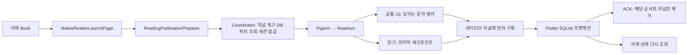

# 쿠피리더 구조·안정성·유지보수성 감사

> 이 문서는 수정 전 감사/계획입니다. 이후 적용 내용과 남은 검증은 [결함 수정 결과](fixes.md)를 확인하세요.

감사일: 2026-09-25. 기준: HEAD `9b02ac1`에 감사 시작 당시의 미커밋 변경을 포함한 작업 트리. 이 보고서는 현재 로컬 소스에 대한 평가이며, 스토어에 배포된 바이너리의 동일성을 보증하지 않는다.

## 결론

**Flutter 서재 + 네이티브 Readium + 공통 위치 식별 JavaScript 구조는 유지하는 것이 적절하다. 전면 재작성보다 서재 저장과 복원 경계의 결함을 먼저 수정해야 한다.** 독서 위치 저장은 세션·순서·본문 버전과 복구 저널을 사용해 비교적 명확하게 설계되어 있다. 반면 책 목록·표지·완독 상태는 SharedPreferences와 파일 시스템에 나뉘어 있어 동시 쓰기와 실패 복구의 보장이 약하다.

우선순위는 **데이터 보존 → 입력·설정 계약 일치 → 실패 격리 → 책임 분리 → 성능 측정 및 개선 → 미사용 항목 정리**다. 파일 길이를 줄이는 리팩터링부터 시작하면 확인된 데이터 문제를 그대로 옮길 수 있다.

- 기능 결함·검증 결함 12건을 아래에 기록했다. P1 4건, P2 8건이다. P0에 해당하는 무조건적 전체 데이터 손실이나 확인된 원격 침해는 발견하지 않았다.
- 7개 임시 재현 검사로 5개 데이터 결함, 설정 수용 범위 차이, 서버/앱 EPUB 검사 차이를 확인했다. 이 검사는 **문제 발생을 기대하는 감사 검사**다. 통과가 수정 완료를 뜻하지 않는다.
- 앱 코드, 기존 테스트, 생성 코드, 패키지, 배포 설정은 수정하지 않았다. 기존 파일 259개를 감사 시작 시 SHA-256으로 기록했고, 빌드 후에도 기존 파일 내용이 그대로임을 확인했다.
- 단계별 실행 계획과 되돌리기는 [개선 계획](improvement-plan.md)에 별도로 정리했다.

## 1. 확인한 범위와 한계

| 범위 | 실제 수행 | 한계 |
|---|---|---|
| Flutter | 진입점부터 import/export/part 그래프, 서재·묶음·가져오기·카탈로그·백업·리더 실행·설정·광고·동의 코드 추적 | 화면 전체를 수동 조작한 UX 감사는 아님 |
| Android | 브리지·Activity·저널·설정·검색/책갈피·페이지 넘김·이미지 캐시·글꼴·배너 코드 확인, Kotlin 컴파일 | Android 기기/에뮬레이터 연결 없음. instrumentation 미실행 |
| iOS | 브리지·ViewController·저널·설정·검색/책갈피·페이지 프레임·글꼴·배너 코드 확인, 시뮬레이터용 빌드 | 부팅된 iPhone/iPad 시뮬레이터는 조회만 함. XCTest·터치·실기기 테스트 미실행 |
| 공통 JS | 위치 식별/복원, 마지막 화면 판정, 패키징 확인. 마지막 화면 Node 검사 실행 | Node 검사는 실제 WebKit/Chromium 레이아웃을 대신하지 않음 |
| Firebase | 로컬 Functions 코드, 규칙, 인덱스·설정, 업로드/게시/삭제 계약 및 단위 테스트 | 배포된 규칙·IAM·CORS 값·콘솔·실제 관리자 웹 프로젝트·운영 문서/파일은 미조회 |
| 데이터 | 메모리 DB와 임시 폴더에서 실패/경합/복원 재현 | 실제 사용자의 DB, 책 파일, 리워드, 동의 기록은 읽거나 변경하지 않음 |
| 성능 | 반복 작업·메인 스레드 I/O·캐시 상한 정적 확인 | 실기기 FPS·RSS·발열·배터리·장시간 지연 실측 없음 |
| 보안 | 파일 검증, 권한 확인 코드, 외부 리소스 차단, 로그 호출 지점 확인 | 침투 테스트, SDK 통신 캡처, 의존성 CVE 전수 조사, 법률 적합성 심사는 아님 |

서버 단위 테스트는 설치된 Node 20.19.2로 실행했다. Functions의 선언 런타임은 Node 22이므로 Node 22와 Firebase Emulator에서의 최종 확인은 남아 있다. 테스트 실행 경로 오류를 바로잡은 뒤 최종 15개가 통과했다.

## 2. 구조와 실행 경로

### 역할

| 계층 | 책임 | 저장/소유 경계 |
|---|---|---|
| Flutter/Riverpod | 서재, 묶음, 검색/필터, 파일 선택, 다운로드, 백업, 광고 동의·리워드, 네이티브 화면 실행 | 로컬 메타데이터와 앱 전역 독서 설정의 최종 소유자 |
| Dart 준비기 | TXT→EPUB 변환, EPUB 검증, 내용 해시, 앱 내부 원본/변환본 보관, 이전 TXT 위치 매핑 | 콘텐츠 식별과 변환 결과. 독서 중 위치를 결정하지 않음 |
| Pigeon 브리지 | 세션·설정·Locator·책갈피·이벤트 계약 | 전송 계약. 생성 파일은 별도 업무 로직이 아님 |
| Android Readium | 실제 조판·페이지/스크롤 이동, 글꼴, 터치, 이미지 넘김, 검색/책갈피 UI | 현재 화면의 일시 상태와 복구용 저널 |
| iOS Readium | 같은 독서 의미를 WebKit/UIKit에 맞춰 구현 | 현재 화면의 일시 상태와 복구용 저널 |
| 공통 JavaScript | 화면에 보이는 문자 위치를 DOM/인용문으로 식별, 같은 문자 복원, 리소스 끝 판정 | 최종 DB 저장 없음. 페이지 번호가 아닌 문자 위치를 반환 |
| Firebase Functions | 관리자 인증, 책/폰트/분류 등록, 게시 스냅샷, 다운로드 URL, 삭제 감사 기록 | 공개 배포 카탈로그. 개인 서재/독서 위치 동기화 서버가 아님 |

실행 근거:

1. `lib/app/router.dart:25`의 두 리더 경로는 모두 `NativeReaderLaunchPage`로 연결된다. 과거 리더 엔진 선택 경로는 없다.
2. `native_reader_launch_page.dart:57`에서 서비스, 이벤트 구독, 원본 준비, 묶음의 다음 권, 광고 상태를 준비한다. 선택적 묶음 오류는 독서 자체를 막지 않으며 광고 초기화 대기는 1초로 제한한다.
3. `native_reader_coordinator.dart:54`는 남은 저널을 먼저 복구하고 `NativeReaderStore`의 설정/Locator를 읽은 뒤 새로운 세션을 발급한다.
4. Android `ReaderActivity.kt:350`, iOS `KoofyReaderViewController.swift:430` 주변에서 Readium 위치를 공통 JS의 문자 앵커로 보강한다. 화면 재조판 세대와 캡처 세대를 확인해 오래된 결과를 버린다.
5. Android `KoofyReaderBridgePlugin.kt:157`, iOS `KoofyReaderViewController.swift:595`는 네이티브 저널 기록 후 이벤트를 전달한다. Dart coordinator는 SQLite 커밋 후 ACK한다. DB 실패에는 ACK하지 않는다.
6. Android `ReaderActivity.kt:716`, iOS `KoofyReaderViewController.swift:562`가 닫기 체크포인트를 만든다. 닫기 시 현재 캡처를 기다리고, 네이티브 저널 저장 실패 시 재시도/오류 경로가 있다. **네이티브 저널 저장 성공과 Flutter DB 최종 커밋 성공은 다른 단계**이며, 후자는 재오픈 복구가 담당한다.

### 최종 저장소와 상태 소유자

| 데이터 | 최종 저장소 | 쓰기 주체 / 평가 |
|---|---|---|
| 책 목록·숨긴 샘플 | SharedPreferences `library_local_books`, backup, hidden 키 | LocalBookRepository. 백업 복원도 직접 기록하여 쓰기 경계가 하나가 아님 |
| 묶음·멤버 순서·멤버 표지 표시 | BookGroupRepository의 JSON 키 | 저장 큐와 revision 기반 undo는 좋음. 복원은 이 큐를 우회 |
| 개인/묶음 표지 | App Support `book_covers` + 책 ID별 pref | BookCoverStore, 복원 코드. 파일 소유권 규칙 충돌 확인 |
| 완독 표시 | `library_completion_v1:<id>` | 명시적인 사용자 설정. 페이지 끝 도달과 구분한 설계 유지 |
| 읽던 위치·책갈피 | `native_reader_v1/reader.sqlite`, book ID + content revision | NativeReaderStore 단일 DB writer. session/generation/sequence 검증 |
| 전역 독서 설정 | 같은 SQLite의 `reader_preferences` 한 행 | 책별 위치와 전역 설정 분리. 오래된 다른 책 이벤트가 전역 설정을 되돌리지 않도록 검사 |
| 네이티브 복구 기록 | Android filesDir / iOS App Support 저널 | 전송 전 내구성 확보용. 영구 독서 DB를 대체하지 않음 |
| 원본/변환본 | 준비기의 publications 해시 폴더와 references | 첫 독서 준비 후 보관. 가져오기 완료 시 보관되지는 않음(F02) |
| 다운로드 도서/폰트 | `cloud_reader`, 폰트 catalog.json | ReaderCatalog가 검증·설치. 기존 버전/고아 파일 정리 정책은 미흡 |
| 리워드·동의 | SharedPreferences 만료 시각 / 버전 있는 동의 키 | 리워드는 보상 콜백에서만 저장. 백업에서 제외 |
| 이전 리더 기록 | immutable legacy backup + 이전 캐시 | 마이그레이션 자료. 삭제 대상 아님 |
| 관리자 카탈로그 | Firestore `readerContent`, `readerSettings`, `readerAudit` + Storage | Admin API 인증 후 관리, 공개 스냅샷만 다운로드 |

## 3. 심각도 순 확인된 문제

P1: 사용자 자료/메타데이터 유실·덮어쓰기 경로로 우선 수정. P2: 조건부 기능 장애·자원 관리·검증 공백. 아래의 “확정”은 명시한 조건에서의 코드/재현 결과를 뜻하며 실제 사용자 기기에서 이미 발생했다고 단정하지 않는다.

### F01 · P1 · 서재의 동시 변경이 서로를 덮어쓴다 — 임시 재현 완료

- 위치: `lib/features/library/data/book_repository.dart:87,126,158,200`; `lib/features/catalog/data/reader_catalog.dart:413`의 설치 완료; `library_backup.dart:277`의 직접 쓰기.
- 조건: 파일 가져오기와 다운로드 설치 등 두 작업이 같은 책 목록을 읽고 각자 새 목록을 저장. `importBooks`의 직렬화는 한 번의 다중 선택 내부에만 적용된다.
- 근거: 두 read를 barrier로 같은 이전 목록에 고정한 뒤 import/saveDownloaded를 실행했다. **두 Future가 성공했지만 저장 목록에는 한 권만 남았다.** 원본 파일 두 개는 존재했다.
- 영향: 서재 항목이 사라지고 묶음에서 보이지 않을 수 있다. 파일이나 독서 DB가 즉시 삭제되는 것은 아니지만 사용자가 접근할 경로를 잃는다.
- 수정: 모든 목록 변경의 read–modify–write를 하나의 repository mutation queue/transaction으로 묶는다. UI 버튼별 busy 플래그로 대체하지 않는다. 복원도 같은 변경 경계를 사용한다.

### F02 · P1 · 가져오기 직후 원본을 영구 보관하지 않는다 — 임시 재현 완료

- 위치: `book_repository.dart:110`의 `localPath: path`; `reading_publication_preparer.dart:59,70,134,149`.
- 조건: 책을 가져왔지만 아직 읽지 않은 상태에서 파일 선택기가 준 임시 파일 또는 사용자가 선택한 원본이 사라짐.
- 근거: 임시 TXT 가져오기 → 원본 삭제 → 서재 항목은 존재 → prepare가 `missing_source` 오류. 앱 소유 복사본은 처음 prepare가 성공한 후에만 생성된다.
- 영향: 특히 여러 권을 한 번에 가져오고 나중에 읽을 때 미열람 책의 독서와 백업이 실패할 수 있다. 파일 선택기 캐시가 실제로 언제 삭제되는지는 OS별 추가 확인 사항이다.
- 수정: 크기·형식 확인과 앱 소유 파일 복사/flush가 성공한 뒤 책 목록에 등록한다. 기존 ID와 읽기 기록을 유지하며 이전 경로를 순차 이관한다.

### F03 · P1 · 복원 실패 후 재시도에서 표지·완독 상태가 누락된다 — 임시 재현 완료

- 위치: `lib/features/backup/data/library_backup.dart:327,342,369`; `library_reading_repository.dart:52`.
- 조건: 복원에서 앞쪽 키들은 저장됐지만 뒤의 저장이 실패. 원래 없던 키를 rollback이 `''`로 복구한 뒤 같은 백업 재시도.
- 근거: 마지막 hidden 키에 한 번 저장 실패를 주입했다. 다음 복원은 성공 반환했지만 완독 상태와 표지가 없었다. 표지는 `containsKey`, 완독은 `getString == null`로 검사하므로 빈 문자열 잔여 키를 기존 데이터로 오인한다.
- 영향: 성공 안내와 실제 복원 상태 불일치. 실패 후 재시도가 복구 수단이 되지 못한다.
- 수정: “키 없음”을 정확히 복원할 삭제 API, empty/tombstone 의미 정의, 복원 계획과 완료 검증. 프로세스 종료까지 견디는 재시작 복구는 U01과 함께 설계한다.

### F04 · P1 · 손상된 서재를 빈 서재로 취급한 뒤 원본까지 덮어쓴다 — 임시 재현 완료

- 위치: `book_repository.dart:176–205,228`.
- 조건: primary와 backup JSON을 모두 해석하지 못하거나 primary 손상 + backup 부재 상태에서 새 책 가져오기.
- 근거: 서로 다른 손상 문자열을 두 키에 넣고 한 권을 가져오면 예외 없이 두 키가 새 한 권 목록으로 바뀐다. 이전 손상 문자열은 남지 않는다. 행 단위 잘못된 데이터도 `_decodeLocalBooks`의 filtering에서 제외될 수 있다.
- 영향: 손상을 감지할 기회를 잃고 복구 가능한 원본 증거까지 제거한다. backup은 같은 새 값을 연속 기록하므로 이 상황에서 보호 장치가 되지 못한다.
- 수정: 부재·정상 빈 목록·손상을 구분한 load 결과. 손상 원문 격리, 쓰기 중단/복구 UI, 유효한 이전 snapshot 유지. 자동으로 `[]`를 새 정상 상태로 저장하지 않는다.

### F05 · P2 · 복원된 표지 하나를 바꾸면 다른 표지도 사라진다 — 임시 재현 완료

- 위치: `library_backup.dart:338`; `book_cover_store.dart:83–107`.
- 조건: 책과 묶음 또는 여러 책에 같은 이미지가 들어 있는 백업을 복원한 뒤 그중 하나의 표지를 초기화/교체.
- 근거: 복원은 이미지 MD5로 동일 파일명을 공유한다. CoverStore는 파일을 각 ID의 전용 파일로 간주하고 삭제한다. 복원 후 책 표지를 reset하면 묶음이 참조하는 PNG도 실제 삭제됐다.
- 영향: 다른 항목의 표지 손실. 백업이 남아 있으면 재구성이 가능하지만 현재 키가 남아 있어 단순 재복원만으로 회복된다고 보장할 수 없다.
- 수정: 우선 복원 표지를 항목별 고유 파일로 저장. 이미 공유된 파일은 참조가 없어질 때만 제거. 향후 자원 참조 테이블 도입 여부는 별도 판단한다.

### F06 · P2 · EPUB 가져오기 메타데이터 파싱이 검증 경계를 우회한다 — 코드로 확인

- 위치: `book_repository.dart:102,246–266,292`; 본문 검증은 `reading_publication_preparer.dart:180,417`.
- 조건: 매우 큰 EPUB 또는 과도하게 팽창하는 container/OPF를 파일 선택기로 가져옴.
- 근거: 가져오기 단계는 크기 확인 없이 전체 파일을 읽고 ZIP/XML을 호출 isolate에서 처리한다. 읽기 준비 단계의 40MiB/항목·해제 용량/CRC 제한은 아직 실행되지 않았다. 예외는 기본 메타데이터로 바꾸고 책을 등록한다.
- 영향: 가져오기 단계 UI 정지·메모리 압박 가능, 나중에 열 때 실패하는 책 등록. **OOM/프레임 지연은 실측하지 않았다.** archive 전체 항목을 즉시 모두 해제한다고 단정하지 않는다. 접근하는 메타데이터 팽창만으로도 상한이 필요하다.
- 수정: 가져오기와 독서 준비가 동일한 bounded inspection 결과를 사용하게 하고 무거운 파싱을 isolate로 이동. 크기 초과는 원본 전체 로딩 전 거부한다.

### F07 · P2 · Dart와 네이티브의 글자 배율 계약이 다르다 — 직렬화 재현 + 코드 확인

- 위치: `native_reader_store.dart:386–395`; Android `KoofyReaderBridgePlugin.kt:108–112`; iOS `KoofyReaderViewController.swift:79`.
- 근거: Dart는 0.5–4.0을 저장/복원 허용하지만 양 네이티브는 0.5–3.0만 허용. 감사 검사에서 3.5 JSON 왕복을 확인했다.
- 조건/영향: 백업 또는 이전 데이터에 3.0 초과 값이 들어오면 복원에는 성공하고 모든 책을 여는 네이티브 validation에서 거부될 수 있다. 현재 양 플랫폼 설정 UI는 3.0을 상한으로 하므로 평상시 UI만으로 재현되는 문제는 아니다.
- 수정: 설정 명세와 유효성 fixture를 하나로 관리. 잘못된 저장 값은 원문 보존 후 명시적으로 복구하거나 복원 전에 거부한다.

### F08 · P2 · 시작 단계 오류가 복구 UI 전에 앱을 멈출 수 있다 — 코드로 확인

- 위치: `lib/main.dart:12–23`; `legacy_reader_archive.dart:26–29,46`; `storage_migration_runner.dart:10`.
- 조건: 기존 legacy backup JSON 손상, 최초 snapshot 저장 실패, Firebase 초기화 예외.
- 근거: runApp 전에 await하지만 예외를 처리하는 부트스트랩 UI/재시도 상태가 없다. legacy backup이 존재하면 그대로 jsonDecode한다.
- 영향: 일부 부가기능/이전 데이터의 오류가 현재 서재 진입까지 차단할 수 있다. 이번 감사에서 실제 기기의 부팅 실패는 재현하지 않았다.
- 수정: BootstrapState로 필수 데이터 보호 실패와 광고/카탈로그 초기화 실패를 구분. 손상 원문을 보존하면서 제한된 서재/복구 화면을 제공한다.

### F09 · P2 · 복구 저널 한 건의 오류가 다른 책 열기까지 막는다 — 코드로 확인

- 위치: Android `ReaderCheckpointJournal.kt:34–40`; iOS `ReaderCheckpointStore.swift:30–37,61–75`; Dart coordinator `:69–78,130–138`, store `:297–305`.
- 조건: Android 저널 JSON 손상, iOS 현재·previous 동시 손상, DB에 없는 세션의 잔여 저널.
- 근거: pending 전체 수집 또는 전체 복구 반복에서 한 건의 오류를 분리하지 않고 throw. 모든 책 open 전에 이를 실행한다.
- 영향: 해당 책 외의 독서 및 백업도 차단. **기록을 조용히 삭제하지 않는 선택 자체는 맞지만, 영향 범위가 너무 넓다.**
- 수정: 문제 레코드를 원문과 함께 격리하고 RecoveryIssue로 노출. 영향받은 책은 저장 위치 확인 전 자동 새 위치 저장을 막고, 관련 없는 책은 이용 가능하게 한다. ACK/삭제로 우회하지 않는다.

### F10 · P2 · 보상 없이 닫힌 광고 객체의 보관 종료 조건이 없다 — 코드로 확인

- 위치: `rewarded_ad_service.dart:38,45,54,130–145`.
- 조건: 광고를 보상 완료 전에 닫아 onAdClosed만 오고 onAdRewarded는 오지 않음. 이를 반복.
- 근거: 늦은 보상을 받기 위해 객체를 유지하지만 timeout/개수 상한이 없다. 목록 제거는 이미 dispose된 객체만 대상으로 한다. 정상 조기 닫기 attempt는 앱 범위 서비스 종료 때까지 남는다.
- 영향: attempt/listener 및 SDK ad 객체가 누적될 수 있다. **실제 네이티브 메모리 증가량은 미측정.** 지연 보상 보존은 반드시 유지해야 한다.
- 수정: SDK 콜백 계약을 확인한 뒤 보상 완료/중복/영구 미도착을 구분하는 수명 정책을 도입. 임의의 짧은 timer로 정당한 보상을 버리지 않는다.

### F11 · P2 · 관리자 업로드 가능 EPUB와 앱이 읽는 EPUB의 범위가 다르다 — 임시 재현 완료

- 위치: `functions/src/content.ts:115–169`; `reading_publication_preparer.dart:417–600,687–762`.
- 근거: valid fixture 본문에 외부 이미지 참조 하나를 넣었다. 서버 `validateUpload`는 1,655바이트 EPUB를 통과시켰고 앱 prepare는 “외부 리소스 … 지원하지 않습니다”로 거부했다. 실제 업로드/게시/외부 HTTP 요청은 하지 않았다.
- 영향: 관리자가 파일 등록을 성공했는데 사용자는 다운로드 후 독서 실패. 파일 수 상한도 서버 10,000/앱 4,096, 해제 총량 서버 150MiB/앱 128MiB로 차이가 있다. 로컬 파일 크기 40MiB/배포 20MiB처럼 의도적인 정책 차이까지 무조건 없앨 필요는 없다.
- 수정: “배포 가능한 EPUB은 앱 지원 범위의 부분집합”을 계약으로 명시하고 공통 fixture를 양쪽 테스트에 적용. 서버의 메타데이터 검사만을 전체 EPUB 호환성 검증으로 부르지 않는다.

### F12 · P2 · 카테고리 선택 테스트가 탭 실패를 놓친다 — 실행 로그로 확인

- 위치: `test/catalog_page_test.dart:150–173`.
- 근거: 역사 ChoiceChip 탭 중심 x=408.1이 390 폭 밖이라는 warning이 발생하지만 테스트는 성공. 클릭 전에도 존재하던 같은 제목만 다시 확인한다.
- 영향: 필터가 작동하지 않아도 회귀 검사가 통과할 수 있다. 이것만으로 실제 앱의 칩 스크롤이 고장났다고 단정하지 않는다.
- 수정: ensureVisible/실제 스크롤 후 탭, 다른 분류를 포함한 fixture, 선택 상태와 결과 제외를 함께 검증. hit-test warning을 실패로 취급한다.

## 4. 추가 검증이 필요한 항목

아래는 코드상 위험 경로이며 사용자 데이터 유실·성능 장애가 실제 발생했다고 확정한 항목이 아니다.

| ID | 위치·조건 | 필요한 검증 / 대응 |
|---|---|---|
| U01 | `library_backup.dart:359–371`의 SQLite transaction 안에서 SharedPreferences 여러 키 기록 | OS kill은 catch rollback을 실행하지 않는다. 각 커밋 경계의 process-kill 재시작 테스트. 영속 복원 journal 또는 한 DB로 메타데이터 transaction 통합 검토 |
| U02 | 복원과 기존 catalog download가 겹치는 경우, `backup_page.dart:29`, `reader_catalog.dart:79` | 백업 화면 busy/PopScope는 다른 provider의 다운로드를 멈추지 않는다. 공유 mutation 경계에서 복원/설치/묶음 변경을 직렬화하고 충돌 재현 |
| U03 | 저장소 v1→v4, 업데이트 중단, iOS 보호 데이터 잠금 | 기존 테스트의 마이그레이션 일부 coverage와 별개로 실제 과거 DB fixture, WAL/SHM 일관성, 저널 잔여 포함 업데이트 검증 필요 |
| U04 | `native_reader_store.dart:307`, `:439`와 백업 `:260`의 Locator 검증은 주로 href 확인 | Readium native Locator가 요구하는 type/locations 구조와 malformed fixture 비교. 복원 성공 후 네이티브에서만 실패하는 추가 형식 확인 |
| U05 | `levelplay_service.dart:20,43`에서 timeout 후 `_initializing` 유지 | SDK가 성공/실패 콜백을 영구 누락할 때 재시도가 이전 attempt만 기다리는지 가짜 SDK로 검증. 시도 ID로 늦은 콜백과 재시도 분리 |
| U06 | `ReaderPageFrameProvider.swift:182`, Android bitmap 준비 / iOS sync journal | 긴 책·큰 글씨·회전·백그라운드·메모리 경고를 반복하며 RSS/FPS/저장 latency 측정. 복잡도만으로 느리다고 확정하지 않음 |
| U07 | Functions 일반 error logging, 네이티브 frame 오류, Pigeon 자동 stacktrace | 코드에 독서 본문/토큰을 명시적으로 log하는 구문은 찾지 못했지만 예외 객체에 경로·URL·SDK 정보가 포함될 가능성은 있음. 대표 오류 로그를 가명 데이터로 검사 |
| U08 | 공개 catalog/signed URL API | App Check/호출 제한·운영 예산 알림·CORS·IAM 실제 값은 미검증. 공개 배포 자체는 의도된 기능이며 deny-all rules만으로 서버 호출량을 제한하지는 않음 |
| U09 | source hash별 변환본, 다운로드 옛 버전, restore staging, `reader_sessions` 누적 | 삭제/복원/업데이트 반복 후 고아 파일·행 증가량 측정. references·위치 revision·현재 설치를 기준으로 보존 정책 수립 후 GC. 이름/오래된 날짜만으로 삭제 금지 |

## 5. 책임 집중과 구체적인 분리 방향

줄 수는 생성 코드/빌드 산출물을 제외한 참고 수치다. 분리할 기준은 서로 다른 실패 처리·상태 수명·변경 원인이다.

| 현재 파일 | 책임/영향 평가 | 제안 경계와 인터페이스 |
|---|---|---|
| `library_page.dart` 1,137줄 + `library_groups.dart` 465줄 | 레이아웃/접힘, 검색·정렬·진행률 계산, 가져오기·표지·삭제·묶음 다이얼로그, provider refresh, 여러 busy 플래그. part extension은 같은 private State에 의존하므로 독립된 책임 분리가 아님 | `LibraryViewModel`이 books/groups/reading을 받아 불변 ShelfSnapshot 계산; `LibraryActions`가 import/updateCover/remove의 결과 상태 제공; `LibraryLayout`/`ContinueReadingCard`는 표시와 callback만 담당. repository가 저장 직렬화 소유 |
| iOS `KoofyReaderViewController.swift` 1,182줄 | Readium open, 복원 deadline, 캡처/이동 task, 설정 완료 callback, 제스처/프레임, 광고/footer, 도구·목차, checkpoint까지 보유. bool·세대값·task가 서로 강하게 연결 | 먼저 `ReaderNavigationSession`에 canonical locator/layout generation/in-flight move/timeout 소유권 집중. `navigate(target) async throws`, `apply(preferences) async throws`, `snapshot()` 계약. VC는 UIKit 수명·화면만. Android와 class를 기계적으로 공유하지 말고 동일 상태 전이 fixture 사용 |
| Android `ReaderActivity.kt` 780줄 | 위 책임 + hinge/Activity 수명. PageTurns/Surfaces는 이미 분리됐으므로 그 위 경계를 정리할 필요 | `ReaderNavigationSession` Android 구현; `ReaderChromeController`에 상태 표시/목차/설정 진입; Activity는 attach/detach/pause/resume 위임. 캡처 세대와 복원 세대를 여러 클래스가 쓰지 않도록 단일 writer |
| `reading_publication_preparer.dart` 819줄 | 원본 찾기·보관, 해시/atomicwrite, 인코딩, TXT→EPUB, ZIP/markup/CSS 보안 검사 | `PublicationSourceStore.acquire(book)` / `PublicationInspector.inspect(bytes, policy)` / `TxtEpubConverter.convert(text, metadata, version)` / `PreparedPublicationCache.getOrPrepare(key)`로 분리. prepare facade는 유지 |
| `reader_catalog.dart` 479줄 | HTTP/URL 정책, JSON 모델, 전체 목록 조회, 다운로드, SHA, 설치, Riverpod 작업 상태 | `CatalogApi.listPage/getDownloadTicket`, `VerifiedAssetDownloader.download(ticket, cancel)`, `ContentInstaller.install`와 별도 InstalledIndex snapshot. 단일 파일로 domain/utils를 무작정 합치지 않음 |
| `library_backup.dart` 382줄 | ZIP 포맷/검증, 파일 staging, merge 판단, 다중 저장소 commit·rollback | `BackupCodec`, 순수 `RestorePlanner`, 쓰기를 한곳에서 수행하는 `RestoreExecutor`. planner는 충돌·누락·필요 bytes를 반환; executor는 transaction journal/진행 상태 책임 |
| `native_reader_store.dart` 460줄 | SQL schema/migration/session/position/globalpreferences/backup merge + JSON validation | DB 단일 writer 유지. 우선 `ReaderPreferencesCodec`/`BookmarkCodec`만 분리하고 전체 reader 저장을 다수 repository로 쪼개지 않음. migration fixture 확보 후 별도 migration module 고려 |
| `functions/src/index.ts` | 인증·CORS·라우팅 + 관리자 작업 orchestration | 필요 시 `AdminContentService`로 수정/게시/삭제 transaction만 이동. `content.ts`의 순수 검증 분리는 유지. 인증을 UI 로그인 여부로 대체하지 않음 |

`privacy_pages.dart` 418줄은 화면 구성/정책 표시 비중이 높다. 줄 수만으로 위 파일과 같은 위험도로 취급하지 않는다. 작은 Palette/Book/AdState/정렬 함수를 다층 추상화할 필요도 없다.

## 6. 중복·공통화와 플랫폼 의미 일치

- **공통화 우선:** 설정 기본값/허용 범위/선택지/JSON 키(F07), 업로드와 앱 지원 EPUB 정책(F11), 오류 코드→사용자 메시지. 서로 같이 바뀌어야 하는 명세를 작게 유지한다.
- **이미 잘 공유됨:** `design/reader_palette.json`→Dart/Kotlin/Swift 생성, `pigeons/reader_api.dart`→세 바인딩, 동일 `reader_anchor.js`를 두 플랫폼에 패키징. Palette `--check` 통과.
- Android가 `../ios/Resources`를 assets로 읽는 것은 코드 중복이 아니라 경로 결합이다. 향후 `shared/resources`로 옮길 수 있으나 패키징/리소스 테스트와 같이 진행하고 기능 수정과 섞지 않는다.
- native checkpoint JSON 모양은 달라도 각 플랫폼 로컬 복구 파일이므로 무조건 포맷을 합칠 이유는 없다. optional 설정 추가·이전 schema 읽기·ACK 의미는 같은 fixture로 검증해야 한다.
- Flutter/Swift/Kotlin/TypeScript에서 같은 언어 코드를 공유하려고 엔진을 다시 만들지 않는다. 작은 명세 + 공통 fixture + 플랫폼별 adapter가 더 적절하다.

| 동작 | 확인 결과 | 남은 점검 |
|---|---|---|
| 페이지/스크롤, 넓은 화면 | 네이티브 Readium 사용. 좁은 폭은 단일 열, 넓은 화면은 두 열 정책. Android hinge 예외는 의도적 플랫폼 차이 | 같은 본문/배율/여백에서 정확한 문자 보존. 모드 전환·광고 높이 변화 동시 발생 실기기 |
| 글꼴·줄간격·문단·여백 | 선택지와 nullable publisher default 의미는 양쪽 동일. fontScale 저장 계약만 F07 | EPUB publisherStyles 영향·매우 큰 접근성 글씨 UI 확인 |
| 검색 | 로컬 Readium 검색, 결과 500개 상한, 다음 페이지, 취소/오래된 결과 차단 존재 | Android 길이는 UTF-16, Swift query.count는 grapheme 기준이므로 이모지 경계의 200자 의미 정하기 |
| 책갈피 | 책당 100, JSON 512KiB, snapshot 저장·삭제실패 보존. iOS swipe/Android 메뉴 차이는 적절 | 잘못된 locator, 저장공간 부족, 연속 삭제 후 늦은 콜백 |
| 마지막 화면·다음 권 | 공통 JS resourceEnd + 각 host 최종 spine 검사. 버튼은 확인 후 다음 권, 완독 자동 설정 안 함 | RTL/이미지 위주 EPUB·단일 화면 장·큰 여백. Node 2개만으로 전체 보장 불가 |
| 닫기·백그라운드 | checkpoint, pending 캡처·세대 검사, 작업 취소·프레임 해제 경로 존재 | 회전 중 닫기·OS kill·보호 데이터 잠금 조합 |
| 광고·동의 | 독서 차단 없이 standard/personalized 선택, iOS ATT 재확인, 실패 시 광고 요청 차단, reward 콜백만 지급 | SDK 실제 전송 데이터, 콘솔 매핑·비맞춤형 광고 실동작은 이번 범위 밖 |

## 7. 성능·자원 관리

**이번에는 런타임 성능 수치를 측정하지 않았다.** 아래는 코드로 확인한 반복 작업과 측정할 가설이다.

- prepare는 캐시 파일이 있어도 `_prepareContent` 변환/검증부터 다시 실행한다(`reading_publication_preparer.dart:59–81`). `_writeVerified`는 중복 쓰기를 줄일 뿐이다. 캐시 키는 source hash만이 아니라 converter/policy version, 제목·저자 등 결과에 영향을 주는 입력을 포함해야 한다.
- TXT decode/TextPublicationMap은 변환 isolate 종료 후 호출 isolate에서 다시 수행된다(`:99–104`). 레거시 매핑이 없는 정상 재열기에도 필요 여부를 판단하지 않는다. 20MiB TXT의 첫 열기/재열기 CPU·heap을 나눠 측정한다.
- `catalogInstalledProvider`는 항목마다 `books.getBooks()` 또는 전체 폰트 manifest를 재조회한다(`reader_catalog.dart:51,301`). N개 카탈로그와 M권 서재에 대해 전체 목록 작업이 반복된다. 설치 snapshot 1회 조회 후 Set membership으로 바꾸는 후보.
- 카탈로그는 모든 서버 페이지를 받은 뒤 가나다 정렬한다(`:25`). 현재 “전체 검색” 의미를 유지하려면 임의로 화면 페이징만 추가하면 안 된다. 목록 증가 시 서버 검색/로컬 색인과 첫 결과 latency를 같이 설계한다.
- iOS `ReaderCheckpointStore.write:17–27`은 main queue에서 JSON encode·원본/previous 쓰기·synchronize를 수행한다. Android는 단일 IO executor에 둔다. iOS 저장 큐 이동 시 journal-before-event와 ACK 순서는 그대로 유지해야 한다.
- 페이지 이미지 캐시는 양쪽 최대 약 5 viewport로 제한하고, iOS snapshot은 2.5M pixel/scale≤2 상한이 있다. **캐시 제한이 없다거나 매번 책 전체를 이미지화한다고 볼 근거는 없다.** 5장의 순수 RGBA는 약 48MiB이지만 숨겨진 WebView·UIKit/Bitmap·임시 surface를 포함한 프로세스 메모리는 별도다.
- dispose/cancel/세대 비교, memory warning, 배경 전환 처리는 이미 존재한다. 검색 작업도 닫을 때 취소한다. 반면 F10 광고 객체, U09 디스크 고아 파일은 별도 보완이 필요하다.
- 전체 서재 build에서 묶음 map/정렬/필터와 읽기 상태 결합을 다시 계산한다. 큰 서재에서 rebuild 원인과 계산량을 프로파일링한 뒤 순수 selector/derived provider로 옮긴다. 먼저 임의의 모든 위젯에 cache를 넣지 않는다.

## 8. 보안·운영

- 본문 준비기의 ZIP 경로·symlink·파일 개수·해제 크기·CRC·스크립트·외부 리소스 검증과 native CSP/offline HTTP 차단은 유지한다. F06의 앞단 메타데이터 파싱에도 같은 방어 경계가 필요하다.
- 백업은 payload 경로 제한·중복 검사·해시·총량 100MiB·책 크기 제한이 있다. 해시는 무결성 검사이며 사용자 제공 백업의 신뢰/서명을 증명하지는 않는다. DB에 넣는 구조와 native Locator의 형식도 맞춰야 한다(U04).
- local rules는 Firestore/Storage 직접 접근 deny-all. 서버는 `slimestrikeforce` issuer의 token과 정확한 `superAdmin == true`를 검사한다. 기존 총괄관리자 로그인 재사용에 맞는 구조다. Admin SDK는 rules와 별개이므로 실제 service account IAM 확인은 따로 필요하다.
- 게시본과 draft 분리, revision conflict, 짧은 signed URL, 삭제 먼저 unpublish/deleting → 파일 제거 → 문서 제거/감사 기록 흐름은 유지할 가치가 있다. API가 무인증으로 관리자 쓰기를 허용하는 경로는 읽은 코드에서 발견하지 않았다.
- 다운로드는 서버 경로를 그대로 임의 파일 경로로 쓰지 않고 확장자/ID/크기/SHA·허용 host·redirect 금지·임시 파일 후 rename을 사용한다.
- Firebase Analytics 콘솔 연결과 실제 앱의 Analytics 이벤트 수집은 같은 말이 아니다. 현재 Dart 의존성에는 firebase_core만 있고 firebase_analytics는 없다. 반대로 광고 SDK 자체의 수집 여부는 별도다. 이 코드 감사로 스토어 개인정보 설문을 변경하지 않는다.
- 리워드 2시간 만료 저장 및 중복 보상 방어는 유지. 서버 결제 검증이 필요한 구매 시스템으로 확대할 근거는 없다. 클라이언트 시간 변경의 영향은 정책 선택/추가 테스트 사항이다.
- 운영 콘솔·privacy URL 내용·스토어 데이터 안전 선언·서비스 계정·규칙 배포 상태·광고 network mapping은 **이번에 확인하지 않았고 변경하지 않았다.**

## 9. 미사용 코드·자산·생성물

| 항목 | 판정 | 근거 / 정리 조건 |
|---|---|---|
| `.env.admob.example` | 삭제 가능한 과거 설정 템플릿 후보 | 현재 실행/빌드 스크립트에는 이 변수 참조가 없고 LevelPlay 사용. README/docs까지 참조 확인 후 별도 cleanup |
| `pubspec.yaml`의 직접 `intl` | 직접 의존성 제거 후보 | lib import 그래프에서 사용 없음. 다른 패키지의 전이 의존성 여부와 lockfile 변화 범위를 확인한 뒤 제거/분석/빌드 |
| `lib/` 전체 Dart 파일 | 파일 단위 미사용으로 확정한 것 없음 | main부터 import/export/part 도달성 검사에서 모두 연결. 개별 private/public symbol 전체를 사용했다고 보증하는 것은 아님 |
| legacy archive/progress/hash_utils 및 저장 키 | 보존 | 이전 위치·책갈피 snapshot과 캐시 식별에 사용. 이름이 legacy여도 사용자 데이터 호환성 코드 |
| `/reader`와 `/reader/native` 두 라우트 | 보존 가능 | 모두 같은 새 리더로 연결하는 호환 alias. 이전 리더 엔진 두 개가 실행되는 의미 아님 |
| `assets/fonts`·iOS Resources/Fonts | 보존 | catalog.json 기반 동적 로딩. iOS 항목은 동일 원본을 가리키는 상대 symlink, Android Gradle assets 등록. 중복 바이너리 소스로 오인해 삭제하면 안 됨 |
| 공통 JS / Pigeon generated 파일 | 보존 | native 등록·resources·양 플랫폼 계약. 원본 JS 및 `pigeons/reader_api.dart`에서 관리 |
| Palette/branding 생성 코드 | 원본 기준 관리 | `design/reader_palette.json`, `assets/branding/book.svg`와 Python generator. 실행 시 쓰이는 생성 Dart/네이티브를 수동 편집하지 않음 |
| Functions lib, Pods, build, work 등 | 산출물/개발 자료로 별도 취급 | 소스 책임 집중 통계에서 제외. 로컬 산출물을 지워도 된다는 판정이나 자동 삭제는 하지 않음 |
| desktop/web scaffold | 보류 | 현재 리더는 Android/iOS만 지원하지만 Flutter 도구/미리보기 필요 여부 확인 전 삭제하지 않음 |

기존 문서에는 과거 구현 설명이 남아 있으며 일부는 historical 안내가 있다. 삭제보다 현재 기준 문서와 변경 이력을 분리해 잘못된 패치 지침으로 사용되지 않게 하는 편이 낫다.

## 10. 테스트 결과와 UX 보장 범위

| 검사 | 이번 결과 |
|---|---|
| Flutter 전체 기존 테스트 | 176 통과. catalog 탭 경고 F12 및 여러 독립 in-memory DB fixture의 Drift warning 존재 |
| Dart analyze(lib/test/pigeons/bridge Dart) | No issues found |
| 감사용 임시 검사 | 7 통과 = 위에 명시한 현재 결함/불일치 재현 |
| TypeScript compile, Functions 단위 | 임시 출력 폴더로 compile, Node 20에서 15 통과 |
| 공통 JS boundary 검사 | 2 통과. viewport/끝 판정 함수 중심, 실제 DOM 조판 아님 |
| Palette 생성 일치 | --check 통과 |
| Android bridge Kotlin | offline compile 성공, up-to-date 포함. 완전 clean/release build 아님 |
| iOS simulator 대상 | generic simulator Debug build 성공, code signing 없음 |
| git diff --check | 통과 |
| Native instrumentation / XCTest 실행 | 이번에는 수행하지 않음. 양 플랫폼에 기존 native 테스트가 있으며 “테스트가 없다”는 뜻이 아님 |
| 실기기·스토어 배포본·운영 API | 미검증 |

기존 검사는 오래된 checkpoint/중복 ACK, 전역 설정, v1 migration, 입력 검증, 백업 기본 round trip, 배너 높이, 접힘 레이아웃 등 중요한 경로를 다룬다. 이번 결함이 빠진 이유는 **동시 repository 변경, 실패 후 같은 백업 재시도, 공유 표지의 수명, 미열람 원본 소실** 조건까지 연결하지 않았기 때문이다.

빈 목록/로딩/실패/재시도 UI는 서재와 카탈로그에 존재하며, 파일 선택 취소와 백업 확인 취소도 처리한다. 백업 실행 중에는 PopScope로 이탈을 막는다. 긴 다운로드 자체의 명시적 취소와 느린 연속 전송의 전체 deadline은 보완 후보다. 에러 문자열을 그대로 붙이는 launch/backup 화면은 내부 경로 노출 가능성과 사용성 측면에서 typed error code + 복구 행동으로 정리하는 것이 좋다.

좁은 화면·큰 글씨·키보드·긴 제목·일반/분할/힌지 화면·VoiceOver/TalkBack은 위젯 테스트 일부로 전체 네이티브 화면까지 검증되지 않는다. 접근성 200%에서 설정/도구/다음 권 버튼이 실제 눌리는지 실기기 회귀 항목으로 남긴다.

## 11. 그대로 유지할 구조

1. 실제 조판은 양 플랫폼 Readium, Flutter는 서재와 앱 기능을 담당하는 경계.
2. 페이지 번호 대신 본문 revision + 문자 Locator로 이어읽기 저장.
3. 네이티브 journal-before-event → SQLite commit → 정확한 sequence ACK.
4. 전역 보기 설정과 책별 독서 위치 분리, 늦은 이벤트의 세대 검사.
5. 묶음의 명시적 순서, revision 비교 undo, 완독을 별도 사용자 상태로 유지.
6. 테마 원본과 생성 코드, Pigeon typed bridge, 공통 앵커 JS.
7. 다운로드 파일의 크기/해시 검증·atomic install, 관리자 게시 snapshot/revision/deleting 상태.
8. 광고 동의와 독서 접근 분리, 지연 reward 콜백의 중복 지급 방지.

**전체 재작성, 일괄 파일 분리, 로컬 데이터 삭제, 저장 포맷 일괄 초기화는 권장하지 않는다.**

## 근거 파일 찾기

본문의 짧은 파일명은 다음 폴더를 기준으로 한다. 모든 위치는 감사 시점 기준이다.

- Flutter 서재: `lib/features/library/{data,presentation,application,domain}`
- 리더 준비/저장/마이그레이션: `lib/features/native_reader/{data,application,migration,presentation}`
- 백업·카탈로그·광고: `lib/features/{backup,catalog,ads}`
- Android: `packages/koofy_reader_bridge/android/src/main/kotlin/com/koofy/reader/bridge`
- iOS: `packages/koofy_reader_bridge/ios/Classes`
- 공통 JS: `packages/koofy_reader_bridge/ios/Resources/reader_anchor.js`
- Firebase: `functions/src`, 루트 rules 및 firebase 설정

재현 코드(문서 첨부): [reproduction-probes.dart.txt](reproduction-probes.dart.txt). 외부 리소스 fixture: [remote-resource-fixture.epub](remote-resource-fixture.epub). 실행과 로그 요약: [verification.md](verification.md).

### 우선 수정 근거 바로가기

- [서재 가져오기와 저장](/Users/choenamho/Documents/GitHub/Koofy-Reader/lib/features/library/data/book_repository.dart:75)
- [복원 rollback/표지/완독](/Users/choenamho/Documents/GitHub/Koofy-Reader/lib/features/backup/data/library_backup.dart:327)
- [표지 파일 삭제](/Users/choenamho/Documents/GitHub/Koofy-Reader/lib/features/library/data/book_cover_store.dart:96)
- [설정 직렬화 범위](/Users/choenamho/Documents/GitHub/Koofy-Reader/lib/features/native_reader/data/native_reader_store.dart:386)
- [Android 설정 허용 범위](/Users/choenamho/Documents/GitHub/Koofy-Reader/packages/koofy_reader_bridge/android/src/main/kotlin/com/koofy/reader/bridge/KoofyReaderBridgePlugin.kt:108)
- [iOS 설정 허용 범위](/Users/choenamho/Documents/GitHub/Koofy-Reader/packages/koofy_reader_bridge/ios/Classes/KoofyReaderViewController.swift:79)
- [서버 EPUB 검사](/Users/choenamho/Documents/GitHub/Koofy-Reader/functions/src/content.ts:115)
- [앱 EPUB 검사](/Users/choenamho/Documents/GitHub/Koofy-Reader/lib/features/native_reader/data/reading_publication_preparer.dart:417)
- [카테고리 테스트](/Users/choenamho/Documents/GitHub/Koofy-Reader/test/catalog_page_test.dart:171)
