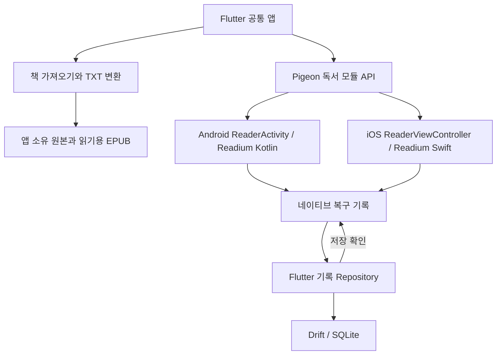

# Koofy Reader 아키텍처

> 현재 구현 상태: [Readium 단일 리더 전환](readium-cutover.md). 이 문서의 후속 제품 기능은 목표 설계이며 모두 구현되었다는 뜻은 아닙니다.

> 2026-09-25 추가: 전경 로컬 한국어 TTS 구현과 검증 범위는 [책 읽어주기 구현 기록](reader-tts.md)을 따른다. 아래 TTS 후속 작업 표현은 최초 설계 시점의 범위다.

검수일: 2026-09-19  
상태: 리팩터링을 위한 설계 기준. 아래 구조의 구현 또는 실기기 검증이 완료되었다는 의미는 아니다.

현재 패치의 구현 범위·실행 방법·남은 검증은 [G1 구현 기록](reader-g1-implementation.md)을 참고한다. 이 문서의 목표 기능과 실제 제공 기능을 구분한다.

이 문서는 Android와 iOS를 함께 지원하는 Koofy Reader의 목표 구조를 정의한다. 기존 구현을 보존하는 것보다 독서 품질과 유지보수 가능성을 우선한다. 구현 단계와 합격 기준은 [독서 검증 계획](reader-validation-plan.md)을 따른다. 과거의 [Reader Core Reference Plan](reader-core-reference-plan.md)은 기존 자체 엔진의 문제를 설명하는 참고 기록으로 남긴다.

## 1. 결정과 검수 결과

**Flutter 공통 앱 + Android/iOS 공식 Readium 독서 모듈 + Pigeon 연결 + Drift/SQLite 저장**을 채택할 목표 구조로 정한다. TXT는 가져올 때 내부 EPUB으로 변환하여 EPUB과 같은 독서 경로를 사용한다. 양쪽 플랫폼의 Readium 구현은 별개이며, 픽셀 단위로 동일한 화면을 보장하지 않는다.

| 검수 항목 | 확정 또는 보완한 내용 |
| --- | --- |
| 공통 앱과 독서 화면 | Flutter가 공통 기능을 담당하고, 본문과 독서 중 메뉴는 네이티브 전체 화면에서 처리한다. |
| 엔진 연결 | 공식 Readium Kotlin/Swift를 자체 연결 모듈 뒤에 둔다. 외부 Flutter 래퍼는 평가·참고 대상이며 앱의 도메인 모델이 래퍼 API에 직접 의존하지 않는다. |
| 독서 기록 | Flutter 응답과 종료 콜백만으로 저장을 보장하지 않는다. 네이티브 복구 기록과 DB 저장 확인 절차를 추가한다. |
| TXT 변환 | 같은 원본과 같은 변환 규칙에서 안정적인 문서 주소와 문단 ID를 생성한다. 변환 변경은 콘텐츠 리비전 변경으로 취급한다. |
| 폴더블 | Readium의 두 열 지원이 임의 위치의 힌지 대응을 보장하지 않는다. 실제 배치 검증과 단일 패널 대체 동작을 둔다. |
| 위치 복원 | Locator를 영구 위치의 기준으로 사용하되, 실제 본문 앵커와 화면 표시 범위로 검증한다. 진행률이나 페이지 번호로 정확한 복원을 대신하지 않는다. |
| 개발 순서 | Android와 iOS에서 작은 독서 모듈을 함께 검증한 뒤 앱 전체를 이행한다. |

네이티브 전체 화면을 기본으로 선택한 것은 Flutter Platform Views의 합성·성능·텍스트 선택 관련 절충을 고려한 설계 판단이다. 임베딩이 불가능하다는 의미는 아니다. 전체 화면도 플랫폼 생명주기와 기록 전달을 직접 구현해야 한다. [Flutter Android Platform Views](https://docs.flutter.dev/platform-integration/android/platform-views), [iOS Platform Views](https://docs.flutter.dev/platform-integration/ios/platform-views)

### 선택하지 않은 기본안

| 대안 | 현재 기본안으로 선택하지 않는 이유 |
| --- | --- |
| 앱 전체를 Kotlin과 Swift로 각각 제작 | 플랫폼 제어는 직접적이지만 서재·가져오기·계정·기록 기능까지 두 벌로 유지한다. |
| Flutter TextPainter 자체 페이지 엔진 확장 | EPUB 구조, 선택, 접근성, 페이지 경계와 위치 복원을 계속 직접 구현해야 한다. |
| Flutter WebView에 웹 EPUB 엔진 연결 | 가능한 대안이나 모바일 독서 화면·접근성·생명주기 연결을 별도로 책임져야 한다. 모바일 중심 요구에서는 공식 모바일 Readium을 우선한다. |
| 외부 Flutter 래퍼 API를 앱 전역에서 직접 사용 | 제공 기능과 SDK 버전이 래퍼에 종속된다. 자체 연결 경계와 동일한 검증 기준을 유지한다. |

## 2. 제품 범위

첫 출시 범위는 로컬 파일로 가져온 **DRM 없는 리플로우 EPUB 2/3 및 TXT**, 한글·영문 가로쓰기, 페이지 넘김·연속 스크롤, 한쪽·양쪽 페이지, 독서 설정, 목차, 검색, 책갈피, 읽던 위치 복원이다. 네트워크 없이 가져온 책을 읽을 수 있어야 한다.

문장 선택과 접근성은 엔진 검증부터 확인한다. 하이라이트·메모 저장 UI는 기본 독서 흐름을 통과한 다음 추가한다. 고정 레이아웃 EPUB, 세로쓰기·RTL, PDF, 만화, TTS, 문장 카드, 계정 동기화는 별도 지원 검증을 거쳐 확장한다. 지원 범위 밖의 파일을 평문으로 자동 변환하거나 빈 화면으로 표시하지 않고, 지원 여부를 알려준다.

Readium 지원 목록과 Koofy의 출시 지원 목록은 구분한다. DRM은 콘텐츠 공급·계약 요구가 정해졌을 때 별도 설계하며, Readium 채택이 네이버 등 다른 서비스의 보호된 책과의 호환성을 의미하지 않는다. [Readium Mobile](https://readium.org/mobile/)

## 3. 구성과 책임

그림의 공통 노드는 논리적인 역할이다. Android와 iOS가 실행 중 같은 디스크나 프로세스를 공유한다는 뜻은 아니다.

| 계층 | 책임 | 두지 않을 책임 |
| --- | --- | --- |
| Flutter UI / Riverpod | 서재, 파일 가져오기, 책 정보, 공통 설정, 기록 조회, 향후 계정 | 본문 픽셀로 위치 추정, EPUB 페이지 경계 계산 |
| Import / Publication Repository | 원본 보관, TXT 변환, 책 식별자, 콘텐츠 리비전, 읽기 리소스 준비 | 특정 화면 크기에 맞춘 분할 |
| Pigeon 연결 모듈 | 타입이 있는 요청·응답·이벤트, 세션 식별, 오류 전달 | DB 스키마 소유, 페이지 계산 |
| 네이티브 ReaderSession | Readium 연결, 페이지 이동, 표시 위치, 설정 적용, 네이티브 메뉴, 복구 기록 | Flutter 위젯 생명주기에 의존한 독서 상태 |
| Flutter 기록 Repository | 유일한 도메인 DB 쓰기 주체, 중복 처리 방지, 복구 기록 반영, 마이그레이션 | 독서 엔진의 내부 DOM 재해석 |

초기에는 앱당 활성 독서 세션을 하나로 제한한다. 분할 화면 크기 변경은 지원하지만, 여러 책을 동시에 여는 다중 독서 세션은 별도 확장이다.

### 네이티브 화면

- Android: 별도 ReaderActivity/Fragment 호스트 안에 검증한 Readium EPUB navigator와 독서 메뉴를 둔다. Flutter 호스트 화면과 수명·복귀 경로를 명시한다.
- iOS: ReaderViewController를 전체 화면으로 표시하고, Readium navigator를 올바른 자식 컨트롤러 수명 관리 아래에 둔다. 화면별 scene 수명과 복귀 경로를 처리한다.
- 목차·검색·글꼴 설정·문장 선택 메뉴도 네이티브 독서 화면에 둔다. 디자인 규칙은 공유하되 구현 일부가 Kotlin/Swift로 중복되는 비용을 수용한다.
- 독서 화면을 열 때마다 FlutterEngine을 새로 만들지 않는다. FlutterEngine의 보존·재연결·프로세스 재시작 동작은 첫 연결 실험에서 확정한다.
- Flutter 화면의 paused/inactive와 독서 세션 종료를 동일하게 취급하지 않는다. 엔진 생존 여부와 플랫폼의 백그라운드 제한도 구분한다.

Flutter와 네이티브의 명령 연결에는 Pigeon을 사용한다. 양쪽 생성 코드는 같은 Pigeon 버전에서 생성하고 함께 변경한다. Pigeon 자체가 상태 동기화나 디스크 저장을 보장하지는 않는다. [플랫폼 연결 문서](https://docs.flutter.dev/platform-integration/platform-channels), [Pigeon](https://pub.dev/packages/pigeon)

## 4. 화면과 독서 설정

| 화면 | 표시 내용 | 구현 |
| --- | --- | --- |
| 서재 | 최근 읽기, 책 목록, 진행률, 가져오기, 정렬 | Flutter |
| 가져오기 | 파일 선택, 인코딩 확인, 처리 상태, 오류 | Flutter + 플랫폼 파일 접근 |
| 책 정보 | 제목·저자·파일 정보·삭제·읽기 | Flutter 패널 |
| 독서 | 본문, 넘김, 진행 정보, 메뉴 | 네이티브 전체 화면 |
| 목차·검색·책갈피 | 이동 대상 목록과 본문 이동 | 네이티브 패널 |
| 독서 설정 | 글꼴, 크기, 줄 간격, 여백, 테마, 읽기 방식 | 네이티브 패널 |
| 앱 설정 | 기본값, 저장 공간, 기록 관리 | Flutter |

책의 각 페이지는 별도 앱 화면이 아니다. 독서 화면 하나가 엔진의 현재 표시 범위를 보여준다.

- `flow`: `paginated` / `scrolled`.
- `spreadPolicy`: `auto` / `single` / `double`. 초기 스크롤 모드는 단일 열로 제공한다.
- 사용자가 요청한 설정과 엔진이 실제 적용한 설정을 구분한다. 적용할 수 없는 조합은 UI에서 알려준다.
- 메뉴를 여닫거나 검색 키보드가 나타나는 것은 사용자의 책 이동으로 기록하지 않는다. 본문 크기가 바뀌면 같은 위치를 기준으로 재배치한다.
- 광고·시스템 바·키보드·글꼴 로딩 완료로 인한 크기 변경도 레이아웃 입력이다. 독서 화면의 광고 추가는 높이 고정 또는 동일한 재배치 계약을 충족한 뒤 진행한다.

## 5. Pigeon 계약과 세션 상태

아래 이름은 구현 계약의 초안이며 존재하는 API가 아니다. Readium과 Pigeon의 선택 버전에서 실제 타입을 확정한다.

| 요청·이벤트 | 의미 |
| --- | --- |
| `openReader` | 책 ID, 콘텐츠 리비전, 앱 내부 파일 참조, 초기 Locator, 설정, 세션 정보를 전달한다. 접수와 준비 완료를 구분한다. |
| `readerReady` | 파일 열기와 초기 위치 복원이 완료되어 본문을 사용할 수 있다. 화면 생성만으로 발생시키지 않는다. |
| `goTo` / `applyPreferences` | 요청 ID와 레이아웃 세대를 포함한다. 오래된 요청 완료가 최신 상태를 덮어쓰지 않는다. |
| `locationChanged` | 안정된 표시 위치와 원인을 전달한다. 프로그램 복원·레이아웃 변경·사용자 이동을 구별한다. |
| `readerMutation` | 책갈피·메모·설정 등 저장할 변경. 중복 방지용 작업 ID를 포함한다. |
| `requestClose` / `readerClosed` | 종료 요청과 실제 종료 완료를 구분한다. 저장 확인 또는 복구 가능한 로컬 기록을 확보한다. |
| `readerError` | 파일 접근, 파싱, 지원 범위, 복원, 저장 실패를 구분한다. |

이벤트에는 `protocolVersion`, `sessionId`, `sessionGeneration`, `contentRevision`, `sequence`를 포함한다. 새 세션 생성은 직렬화하며, 이전 세션의 늦은 위치 이벤트는 새 위치를 덮어쓸 수 없다. 시계 시간만으로 최신 이벤트를 결정하지 않는다.

`sessionGeneration`은 메모리 카운터가 아니다. 이전 복구 기록을 반영한 뒤 SQLite 트랜잭션에서 증가·확정하여 `openReader`에 전달하고 네이티브 기록에도 보관한다. 재생성 시 기존 세대·순서를 복원하거나 DB와 연결한 후 새 세대를 발급한다. 재시작마다 0으로 초기화하지 않는다. 이 순서는 해당 기기 안의 순서이며 향후 여러 기기의 동기화 충돌 해결 규칙을 대신하지 않는다.

세션 상태는 `opening → restoring → ready → relayout/restoring → ready → closing → closed`와 `failed`를 명시적으로 관리한다. 초기 복원과 재배치 중 발생하는 임시 첫 위치를 정상 독서 기록으로 저장하지 않는다. 준비 전 이동 요청은 최신 유효 요청으로 정리하고, 이전 작업은 취소하거나 완료 결과를 무시한다.

API 접수 응답, 화면 준비 이벤트, 디스크 저장 확인은 서로 다른 의미다. 긴 독서 세션 전체를 하나의 미완료 Pigeon 호출로 유지하지 않는다.

## 6. 영구 위치와 복구 기록

### 데이터 모델

| 정보 | 용도 |
| --- | --- |
| `publicationId` | 서재 항목의 지속적인 ID |
| `sourceFingerprint` | 원본 바이트의 SHA-256 등 콘텐츠 확인용 식별값 |
| `contentRevision` | 원본 또는 TXT 변환 결과의 논리적 리비전 |
| `locatorSchemaVersion` / `engineInfo` | 위치 직렬화 형식과 생성 엔진을 추적 |
| `locatorPayload` | Readium이 제공하는 자원 주소·위치·본문 문맥을 가능한 한 보존 |
| `progression` | 표시와 최후의 복구 후보용. 정확한 위치를 대체하지 않음 |
| 세션·이벤트 정보 | 오래된 이벤트 차단과 중복 반영 방지 |

두 플랫폼의 Locator를 같은 콘텐츠 리비전에서 서로 복원할 수 있는지는 실제로 검증한다. 로컬 절대 경로를 책 내부의 영구 주소로 저장하지 않는다. 레이아웃 캐시의 페이지 번호·스크롤 픽셀은 영구 위치와 분리한다.

### 저장 책임과 종료

**Drift/SQLite 도메인 DB의 쓰기는 Flutter 기록 Repository 한 곳에서 담당한다.** 네이티브가 같은 DB를 별도로 직접 수정하지 않는다. 대신 네이티브 모듈은 DB 반영 전의 복구용 기록을 앱 내부 영구 저장소에 둔다.

1. 안정된 Locator를 얻으면 순서 번호를 부여하고 네이티브 체크포인트를 원자적으로 교체한다. 본문 전체는 기록하지 않는다.
2. 책갈피·메모·설정 변경은 고유 작업 ID가 있는 복구 큐에 내구성 있게 기록한다. 미반영 작업을 위치 체크포인트 교체 과정에서 없애지 않는다.
3. Pigeon으로 Flutter에 전달한다. Flutter가 응답하지 않거나 재연결 중이면 복구 기록을 유지한다.
4. Flutter는 콘텐츠 리비전과 이벤트 순서를 확인하고 SQLite 트랜잭션으로 반영한 뒤 정확한 체크포인트/작업의 저장을 확인한다.
5. 네이티브는 확인받은 항목만 정리한다. 새 항목이 이전 저장 확인 때문에 지워지지 않게 한다.
6. 다음 실행에서 복구 기록을 먼저 반영한 후 초기 위치를 선택한다. 작업 ID로 재전송을 중복 적용하지 않는다.

위치의 최신 여부와 사용자 변경의 중복 여부는 따로 판단한다. 새 세션 또는 더 높은 위치 순서 번호가 존재해도 미확인 메모·책갈피 작업을 버리지 않는다. 사용자 변경은 별도 작업 ID 처리 기록으로 반영하며, 이전 콘텐츠 리비전에 속한 변경도 해당 리비전에 보존하거나 명시적으로 이전한다.

체크포인트는 캐시·임시 디렉터리에 두지 않는다. 파일 형식 버전과 무결성을 검사하고, 읽기 실패 시 마지막 유효 기록으로 복구한다. 진행률 기록은 최신 값으로 합칠 수 있지만 사용자 메모 작업은 확인 전 누락할 수 없다.

쓰기 빈도는 프레임 단위가 아닌 페이지 이동 완료·스크롤 안정 상태를 기준으로 제한한다. 스크롤 위치는 짧게 합쳐 저장할 수 있으나 최대 미저장 구간을 두 플랫폼에서 측정·확정한다. 메모 저장 성공 표시는 최소한 복구 큐의 내구성 기록이 끝난 뒤에만 한다.

정상 종료는 DB 저장 확인을 받거나 내구성 있는 복구 기록을 확보한 뒤 완료한다. Flutter 응답을 무기한 기다리지 않는다. 저장소가 가득 차 두 경로 모두 실패하면 저장 실패를 사용자에게 알리고 성공으로 표시하지 않는다.

OS 종료·충돌 시 마지막 콜백은 보장되지 않는다. 따라서 종료 시점만 기다리지 않고 독서 중에도 저장한다. 강제 종료 후 보장할 기준은 **마지막으로 내구성 저장이 완료된 위치와 변경**이며 마지막 눈동자 위치나 미완료 쓰기를 보장하지 않는다. [Flutter 생명주기](https://api.flutter.dev/flutter/dart-ui/AppLifecycleState.html)

DB 저장 확인 후 체크포인트가 이미 정리된 상태에서 OS가 네이티브 호스트만 다시 생성할 수 있다. 이때 빈 체크포인트나 과거 Intent/화면 복원 인자로 초기 위치를 결정하지 않는다. FlutterEngine·Repository 재연결 → 남은 복구 기록 반영 → DB 위치 조회가 끝날 때까지 `restoring`에 머물고 위치를 쓰지 않는다. 재연결 실패 시 독서 화면에 오류와 서재 복귀·앱 재시도 경로를 제공한다. Readium navigator도 파일과 복원 데이터 준비 후 재구성하며, 플랫폼 화면 자동 복원만으로 세션이 완성된다고 가정하지 않는다.

### 재배치와 사용자의 읽기 기준

현재 위치 확보 → 새 가용 공간·설정 적용 → 본문 재배치 → 위치 포함 범위로 이동 → 안정 상태 확인 → 저장 재개 순서를 따른다. 오래된 레이아웃 결과는 세대 번호로 무시한다.

앱은 사용자가 양쪽 페이지 중 어느 문장을 눈으로 읽는지 알 수 없다. 선택 또는 TTS 위치가 있으면 그것을 우선하고, 그 외에는 현재 펼침의 시작 위치를 기준으로 한다. 재배치 직후 생긴 페이지 시작점 때문에 기준 위치가 반복해서 뒤로 밀리지 않도록, 재배치용 앵커와 실제 표시 범위의 시작을 구분한다.

## 7. 원본 보관과 TXT 변환

### 가져오기

- 시스템 파일 선택 결과를 앱 소유 영구 저장소로 복사하고 원본을 보존한다. 일시적인 외부 파일 경로만 DB에 저장하지 않는다.
- 원본 보관과 읽기 리소스 준비를 완료한 뒤 서재의 사용 가능한 책으로 등록한다. 중단된 가져오기를 감지·정리할 수 있게 한다.
- EPUB은 본문을 평문으로 추출하지 않고 원래 문서·스타일·이미지·링크 구조를 읽기 엔진에 전달한다.
- 외부에서 가져온 책의 스크립트와 원격 리소스는 기본 비활성 정책으로 두고, 앱 내부 파일 접근 범위를 제한한다. 압축 해제 경로·용량·손상 검사를 적용한다.

### TXT → EPUB

1. BOM 등을 확인하고 UTF-8/UTF-16을 판별한다. 판별이 모호한 한국어 파일은 CP949/EUC-KR 등의 인코딩 선택과 미리보기를 제공한다. 깨진 문자를 조용히 대체하여 확정하지 않는다.
2. 줄바꿈·문단·챕터 구분 규칙을 버전으로 관리한다. 화면 너비나 글자 크기로 챕터를 나누지 않는다.
3. 텍스트를 안전하게 이스케이프한 XHTML과 목차·메타데이터를 생성한다. 제목 추정이 어려우면 일정한 문단 단위의 섹션을 사용한다.
4. 같은 원본과 같은 변환 설정에서 같은 섹션 href·문단 ID가 생성되도록 한다. 중복 문단도 구분한다. 안정성은 논리적 문서 주소 기준이며 ZIP 생성 시각까지 같은 바이트를 요구하는 것은 아니다.
5. 원본 fingerprint, 선택한 인코딩, 변환 버전·설정을 저장한다. 생성 결과를 매번 다시 만들지 않고 리비전별로 보관한다.
6. 개발·CI에서 생성 샘플을 EPUBCheck로 검사하고 양쪽 Readium에서 화면과 위치 복원을 확인한다. EPUBCheck 통과만으로 렌더링 품질을 보장하지 않는다.

변환 규칙 또는 원본이 바뀌면 새 `contentRevision`을 만든다. 이전 Locator를 새 리비전에 그대로 적용하지 않는다. 원문→문단/문자→XHTML 주소의 매핑을 보존해 이전 위치를 옮길 수 있게 한다. [EPUBCheck](https://www.w3.org/publishing/epubcheck/)

출력 XHTML/CSS는 UTF-8로 생성하고 EPUB package/nav/spine 및 OCF 구성 제약을 따른다. CP949 등의 처리는 TXT 입력용 정책이며 EPUB 출력 인코딩이 아니다. [EPUB 규격](https://www.w3.org/TR/epub-33/)

## 8. 폴더블과 페이지네이션

- `columnCount`는 리플로우 EPUB의 페이지 모드에서 사용하는 기능이다. 고정 레이아웃의 spread 설정과 구분한다.
- 자동 양쪽 배치는 현재 창, 실제 본문 영역, 힌지의 bounds·방향·분리/가림 여부, 글자 크기와 양쪽 페이지의 읽기 가능한 너비를 함께 판단한다.
- 가로 접힘이 있다는 이유만으로 좌우 두 페이지를 표시하지 않는다. 중앙이 아닌 힌지도 고려한다.
- 엔진의 균등한 두 열이 실제 힌지를 피할 수 있는지 실기기로 확인한다. 맞지 않으면 사용 가능한 한 패널에 단일 페이지를 표시한다. 전체 폭의 단일 페이지가 힌지를 가로지르는 동작으로 대체하지 않는다.
- 힌지가 없는 넓은 화면에서는 두 열을 사용할 수 있다. 사용자가 두 페이지를 요청해도 글자 크기와 공간 제약으로 적용할 수 없으면 유효한 모드와 이유를 표시한다.
- 좌우 페이지는 하나의 문서 흐름에서 연속된 범위여야 한다. 독립적으로 움직이는 뷰어 두 개로 동기화 문제를 만들지 않는다.

양쪽 페이지 지원과 임의 힌지 배치 지원은 각각 검증한다. 이 제약이 목표 폴더블 기기의 필수 경험을 충족하지 못하면 해당 기능을 완료로 표시하지 않고 레이아웃 어댑터 또는 엔진 선택을 재검토한다. [Readium 설정](https://github.com/readium/kotlin-toolkit/blob/develop/docs/guides/navigator/preferences.md), [Android 폴더블](https://developer.android.com/develop/adaptive-apps/guides/foldables/learn-about-foldables)

페이지 넘김, Readium의 독서 위치 단위, 인쇄본 페이지, 현재 레이아웃의 화면 총 페이지 수는 서로 다르다. 첫 버전은 진행률과 챕터 정보를 기본 표시한다. 정확한 전체 화면 페이지 수가 필수가 되면 장 전체의 계산·캐시·무효화 비용을 포함한 별도 엔진 선정 조건으로 올린다. [Readium Navigator](https://raw.githubusercontent.com/readium/kotlin-toolkit/3.3.0/docs/guides/navigator/navigator.md)

## 9. 기술·도구·스킬

| 영역 | 선택 |
| --- | --- |
| 공통 앱 | Flutter / Dart / Riverpod |
| 네이티브 독서 | 공식 Readium Kotlin, Readium Swift와 플랫폼 UI |
| 연결 | 자체 Flutter 플러그인 형태의 얇은 모듈 + Pigeon |
| 저장 | Drift / SQLite. 간단한 환경값에만 shared_preferences |
| 파일 | 앱 소유 원본 저장소, 버전이 있는 변환 EPUB, 별도 복구 기록 |
| 환경 고정 | FVM, pubspec.lock, 플랫폼 의존성 잠금 파일 |
| 개발 | Android Studio / Android SDK, Xcode / iOS SDK, Git |
| 성능 | Flutter DevTools, Android Profiler, Xcode Instruments |
| 검증 | Flutter test/integration_test, Android 네이티브 UI 테스트, XCUITest, EPUBCheck |
| 자동화 | GitHub Actions에서 분석·테스트·Android/iOS 빌드. iOS는 macOS 실행 환경 |

[FVM](https://fvm.app/)으로 Flutter 버전을 고정하고 [Drift](https://drift.simonbinder.eu/)에서 DB 마이그레이션을 관리한다. 최신 버전이라는 이유만으로 업데이트하지 않는다. Flutter, Dart, Readium 양쪽 SDK, Pigeon, Kotlin/JDK/Gradle, Xcode/Swift, 최소 OS의 **실제로 빌드·검증한 조합**을 첫 검증 단계에서 기록한다. 아직 검증하지 않은 버전 번호를 이 문서에서 확정하지 않는다.

새 Readium Compose navigator는 공식 문서상 실험 단계다. 초기 Android는 선택한 안정 릴리스의 기존 EPUB navigator를 우선 검증한다. Kotlin/Swift의 지원 기능과 외부 Flutter 래퍼의 노출 기능을 동일하다고 가정하지 않는다. [Readium Web Navigators](https://readium.org/kotlin-toolkit/latest/guides/navigator/web-navigators/), [외부 Flutter 래퍼](https://pub.dev/packages/flutter_readium)

스킬은 런타임 라이브러리가 아닌 개발 절차다. 필요한 경우 `skill-creator`로 독서 모듈 연결·회귀 검증 절차를 만들고, 프로젝트 규칙을 `AGENTS.md`에 정리한다. `visualize`는 화면 흐름 검토, `imagegen`은 아이콘·일러스트, OpenAI Docs는 Codex 설정 확인에 사용한다. 이 문서화 작업에서 새 스킬이나 플러그인을 설치한 것은 아니다.

## 10. 이행 원칙과 미확정 항목

기존 앱에 새 독서 모듈을 별도 경로로 넣어 검증한 뒤 교체한다. 기존 코드 보존은 목표가 아니지만, 원본 책·독서 기록·책갈피를 삭제하는 방식으로 시작하지 않는다. 기존 위치 모델과 자체 엔진의 재현 사례는 마이그레이션 입력과 회귀 테스트 자료로 사용한다.

- 기존 TXT 기록: 과거 정규화 결과의 문자 위치를 새 변환 문단 주소로 매핑한다. 과거 위치가 추정치였던 사실을 보존한다.
- 기존 EPUB 기록: 평문 offset을 원본 EPUB Locator로 직접 복사하지 않는다. 섹션·인용문 문맥으로 매핑하고 모호하면 정확 복원 성공으로 표시하지 않는다.
- 기록 이전 실패 시 원래 데이터를 보존하고 사용자가 책을 다시 열 수 있게 한다. 백업·재시도 가능한 마이그레이션을 만든다.
- 독서 중의 현재 위치와 가장 멀리 읽은 위치는 분리한다. 향후 동기화가 생겨도 되돌아 읽은 위치를 최대 진행률로 덮어쓰지 않는다.
- TTS, 클라우드 동기화, DRM, 광고 변경은 독서 핵심 검증과 독립된 후속 작업이다.

아래 항목은 첫 두 플랫폼 검증에서 결정해야 하며, 일반 기능 개발 전에 통과 여부를 남긴다.

| 미확정 항목 | 결정 근거 |
| --- | --- |
| 정확한 SDK·최소 OS 조합 | 두 플랫폼 빌드·실행과 필수 API 지원 |
| FlutterEngine 소유·재연결 방식 | 네이티브 화면 표시, 호스트 재생성, 프로세스 종료 실험 |
| Readium 열 간격·가용 영역 제어 | 목표 폴더블의 실제 힌지와 한 패널 대체 동작 |
| TXT 변환 세부 규칙과 인코딩 구현 | 한국어 샘플과 안정 주소·변환 성능 |
| Locator의 플랫폼 간 호환 범위 | 동일 리비전의 Android↔iOS 교차 복원 |
| 성능 예산 | 목표 기기와 파일 집합을 고정한 실측. 60/120fps를 사전 보장하지 않음 |

미확정은 설계 방향을 보류한다는 의미가 아니라, 채택한 구조의 구체적 구현을 검증할 경계다. 상세 순서와 기록 양식은 [독서 검증 계획](reader-validation-plan.md)에 정의한다.
